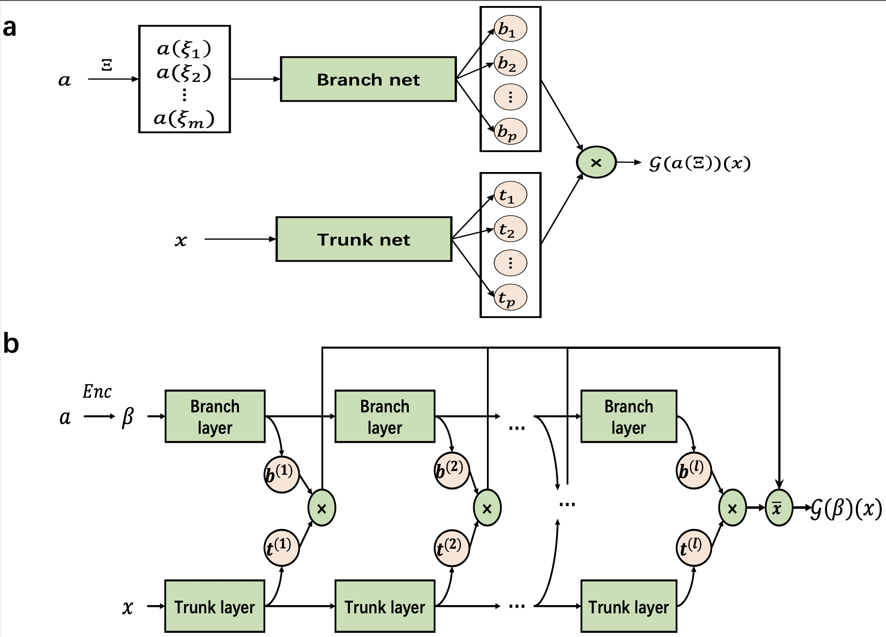

# Darcy’s Flow

## 1. 背景简介

**Darcy’s Flow（达西流）**是描述流体在多孔介质中低速流动的经典模型，由法国工程师亨利·达西（Henry Darcy）在1856年通过实验研究第戎市（Dijon）的供水系统时首次提出。达西通过实验发现，水流通过砂层的流量与压力梯度成正比，与流体粘度成反比，这一规律后来被总结为**达西定律（Darcy’s Law）**，成为渗流力学和地下水文学的基石。达西流假设流体流动缓慢（低雷诺数），且惯性力远小于粘性力和压力梯度，因此流动呈线性关系，适用于土壤、岩石、生物组织等多孔介质中的流体运动。

达西流的应用范围极为广泛，涵盖地下水流动、石油开采、地热工程、生物组织渗透以及工业过滤等领域。在地下水研究中，达西定律用于模拟含水层中的水流动态，评估水资源分布和污染扩散；在石油工程中，它帮助预测油藏中的渗流特性，优化开采方案；而在生物医学领域，达西流模型被用于分析血液在毛细血管网络或药物在组织中的传输过程。尽管达西定律最初基于实验观察，但其数学形式简洁且物理意义明确，成为多孔介质流动理论的核心框架。

随着研究的深入，达西流的局限性也逐渐显现。例如，在高流速条件下，惯性效应不可忽略，流动可能偏离线性关系，此时需采用**非达西模型**，如Forchheimer方程或Brinkman方程加以修正。此外，对于非均质多孔介质、各向异性材料或复杂流体（如非牛顿流体），达西定律需结合更复杂的本构关系或数值方法（如有限元、格子玻尔兹曼方法）进行扩展。近年来，达西流的研究还与多物理场耦合问题紧密结合，例如热-流-固耦合（如地热系统）、化学反应-流动耦合（如污染物迁移）等，进一步推动了其在工程与科学领域的应用。达西流作为连接理论与实践的桥梁，至今仍是渗流力学和资源开发中不可或缺的工具。

## 2. 问题定义

考虑一个区域 $\Omega \subset \mathbb{R}^d$（通常是二维或三维空间），在这个区域中描述压力场 $u(x)$ 的分布，满足以下偏微分方程：

$$
\nabla \cdot (a(x) \nabla u(x)) = f(x), \quad x \in \Omega,
$$

其中：

* $u(x)$ ：标量压力场（待求解）
* $a(x) > 0$ ：空间位置相关的渗透率（Permeability），也称导流系数或张量（可标量也可张量）
* $f(x)$ ：源项，表示体积流入（正）或流出（负）
* $\nabla \cdot$ ：散度算子
* $\nabla u$ ：压力梯度

通常配合 **Dirichlet** 或 **Neumann** 边界条件：

* **Dirichlet 边界条件（压力已知）**：

$$
u(x) = g(x), \quad x \in \partial\Omega_D,
$$

* **Neumann 边界条件（流速已知）**：

$$
(a(x) \nabla u(x)) \cdot \mathbf{n}(x) = h(x), \quad x \in \partial\Omega_N,
$$

其中 $\partial\Omega = \partial\Omega_D \cup \partial\Omega_N$ ，且 $\mathbf{n}(x)$ 是边界外法向量。

在本案例中，我们考虑二维域上的达西流动问题。其控制方程可写为：

$$
-\nabla \cdot (a(x_1,x_2) \nabla u(x_1,x_2)) = f(x_1,x_2), \quad(x_1,x_2) \in \Omega = [0,1]^2,
$$
$$
u(x_1,x_2) = 0, \quad (x_1,x_2) \in \partial \Omega,
$$

这里设为常数 $f=10$ 。对于该正问题，我们关注的是从渗透率场 $a(x_1,x_2)$ 到压力场 $u(x_1,x_2)$ 的映射，即 $\mathcal{G}: a(x_1,x_2) \to u(x_1,x_2)$ 。

## 3. 模型设计

我们采用了一种新颖的神经算子架构，称为 MultiONet 架构。该架构的结构如图b所示。



与DeepONet架构类似，MultiONet架构采用分离表示，由两个神经网络组成：一个被称为“主干网络”，用于编码输出解的空间坐标 ${x} \in \Omega$ ，另一个被称为“分支网络”，用于从输入向量 ${\beta}$ 中提取特征，该 ${\beta}$ 是通过编码器模型自动从输入系数 $a$ 中学习得到的。然而，不同于DeepONet架构，MultiONet架构通过多个主干和分支层的输出向量的平均值来计算最终输出，而不是仅依赖于主干和分支网络输出层的乘积。这一设计在不增加网络参数数量的情况下提升了性能。

如图b所示，MultiONet中分支网络的输入是输入函数的（潜在）表示 ${\beta}$ 。这个表示可以通过学习编码器网络获得，也可以通过傅里叶、切比雪夫或小波变换等方法提取特征。相比之下，DeepONet中的分支网络直接接受离散化的有限维表示 $a(\Xi) = \{a(\xi_1), \cdots, a(\xi_m)\}$ ，这些值对应于预定义的传感器集 $\Xi = \{\xi_1, \cdots, \xi_m\}$ 在 $a$ 上的采样值。这一关键差异使得MultiONet架构在选择分支网络输入方面具有更大灵活性，并且在传感器集 $\Xi$ 较大时大大减少了计算时间。此外，虽然 $a(\Xi)$ 处于高维且不规则的空间（例如在多相介质中， $a$ 是具有不连续性和离散值的场），但潜在空间 ${\beta}$ 是低维的、连续值且规则的。这一转变在解决反问题时具有显著优势，因为在潜在空间中进行优化更高效、更稳健。

此外，MultiONet架构在逼近能力方面优于DeepONet，即使两者参数数量相同。这种改进主要源于MultiONet架构中的平均机制，如图所示，它类似于集成学习的效果，通过汇总多个函数基底的预测结果。在DeepONet架构中，输出是分支和主干网络输出的内积，表达式为：

$$
\mathcal{G}(a(\Xi))({x}) = \sum^{p}_{k=1}b_k(a(\Xi))t_k({x}) + b_0,
$$

其中， $b_k(a(\Xi))$ 和 $t_k({x})$ 分别是分支和主干网络第 $k$ 个分量的输出， $b_0$ 为偏置项。而所提出的MultiONet架构则通过平均多个层的输出内积来计算，表达式为：

$$
\mathcal{G}({\beta})({x}) =\frac{1}{l} \sum^{l}_{k=1}\left(b^{(k)}({\beta})\odot t^{(k)}({x}) +b^{(k)}_0\right),
$$

其中， $b^{(k)}({\beta})$ 和 $t^{(k)}({x})$ 分别表示第 $k$ 层的分支和主干网络的输出， $l$ 为总层数， $b^{(k)}_0$ 为偏置项， $\odot$ 代表内积操作。很容易看出，当只使用分支和主干网络最后层的输出时，DeepONet可以视为MultiONet的一种特例。

为了处理分支网络和主干网络层数不同的情况，架构对输出计算方式进行了如下修改。设 $l_t$ 和 $l_b$ 分别表示主干网络和分支网络的层数，且假设 $l_t > l_b$ 。此时，最终输出通过平均以下形式的内积来计算：

$$
\mathcal{G}({\beta})({x}) =\frac{1}{l_b} \sum^{l_b}_{k=1}\left(b^{(k)}({\beta})\odot t^{(k+l_t-l_b)}({x}) +b^{(k)}_0\right).
$$

MultiONet架构通过提供比DeepONet更强的表达能力，这种增强的表示能力在作为算子逼近器时表现出更优的性能。

## 4.数据集

MultiONet所用的点集 $\Xi$ 取在区域 $\Omega$ 上的规则 $29\times 29$ 网格。输入系数场在相同位置的取值构成了训练数据集 $\{\hat{a}^{(i)}\}_{i=1}^N$ ，用于训练 MultiONet。

为了评估MultiONet方法的性能，我们采用了两个测试数据集：

- **内部分布（in-distribution）测试集**：从训练数据相同的分布中采样 200 个系数字段 $a$ ；
- **分布外（out-of-distribution）测试集**：采样自零截断的高斯过程 $GP(0, (-\Delta + 16I)^{-2})$ 。虽然系数字段的取值范围相同，但其二阶及更高阶的相关函数不同。

我们为每个测试集生成了 200 个样本，并使用有限元法（FEM）在规则 $29\times 29$ 网格上计算对应的 PDE 精确解  $u$。

## 5. 模型训练与评估

- 加载数据集

``` sh
wget -nc -P ./Problems/DarcyFlow_2d/ https://paddle-org.bj.bcebos.com/paddlecfd/datasets/ppdeeponet/darcyflow/smh_train.mat
wget -nc -P ./Problems/DarcyFlow_2d/ https://paddle-org.bj.bcebos.com/paddlecfd/datasets/ppdeeponet/darcyflow/smh_test_in.mat
```

- 模型训练

``` sh
python pimultionet.py
```

- 模型评估

``` sh
wget -nc -P ./saved_models/PIMultiONetBatch_fdm_TS/ https://paddle-org.bj.bcebos.com/paddlecfd/checkpoints/ppdeeponet/darcyflow/loss_pimultionet.mat
wget -nc -P ./saved_models/PIMultiONetBatch_fdm_TS/ https://paddle-org.bj.bcebos.com/paddlecfd/checkpoints/ppdeeponet/darcyflow/model_enc.pdparams
wget -nc -P ./saved_models/PIMultiONetBatch_fdm_TS/ https://paddle-org.bj.bcebos.com/paddlecfd/checkpoints/ppdeeponet/darcyflow/model_u.pdparams

python pimultionet.py --mode eval
```

## 6. 模型结果

如图展示了PI-MultiONet在测试集上预测的压力场与有限元解的对比。可以看出，PI-MultiONet在测试集上表现良好，能够准确预测压力场。


## 7. 参考链接

- https://github.com/yaohua32/Deep-Neural-Operators-for-PDEs
- [DGenNO: a novel physics-aware neural operator for solving forward and inverse PDE problems based on deep, generative probabilistic modeling](https://doi.org/10.1016/j.jcp.2025.114137)
